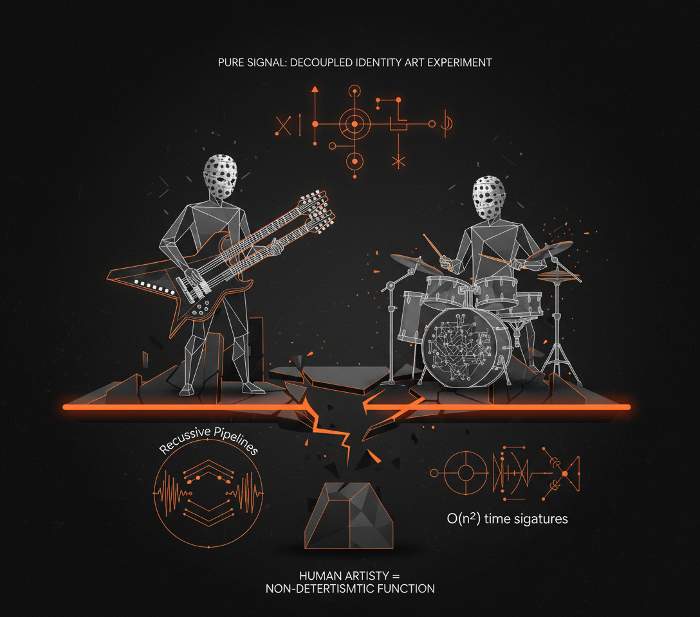
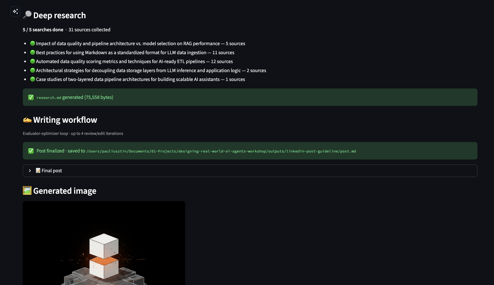

# Build Your Own Deep Research Agent + Technical Writer Multi-Agent System

A hands-on workshop, presented at [AI Engineering Conference Europe](https://www.ai.engineer/europe), building a multi-agent AI system with two MCP servers: a **Deep Research Agent** and a **LinkedIn Writing Workflow**. Both connected to a harness like Claude Code or Cursor.

🎬 Full workshop available on [YouTube](https://www.youtube.com/watch?v=mYSRn6PC1mc) ↓

<a href="https://www.youtube.com/watch?v=mYSRn6PC1mc">
  
</a>

📑 Slides [here](https://drive.google.com/file/d/1RWdS5VQYjz7a9y7NzHhAnyhGtxi6e0vt/view?usp=sharing).

----

## Whenever You're Ready, Here's How to Go Deeper

<a href="https://academy.towardsai.net/courses/agent-engineering?utm_source=github&utm_medium=aieng&utm_campaign=2026_aieng_workshop&utm_id=researchwriter"></a>

This workshop is a 2–4 hour taste. If you want to go from zero to shipping production-grade AI agents, check out our [**Agentic AI Engineering Course**](https://academy.towardsai.net/courses/agent-engineering?utm_source=github&utm_medium=aieng&utm_campaign=2026_aieng_workshop&utm_id=researchwriter), built with Towards AI.

**34 lessons. Three end-to-end portfolio projects. A certificate. And a Discord community with direct access to industry experts and us.**

Rated 5/5 by 300+ students. The first 6 lessons are free:

[**Start here →**](https://academy.towardsai.net/courses/agent-engineering?utm_source=github&utm_medium=aieng&utm_campaign=2026_aieng_workshop&utm_id=researchwriter)

----

## How to Use This Repo

Three ways to use this repo. Pick the mode that fits the time you have. Or work through all three in order, since each builds on the last.

| Mode | Time | What you walk away with | What you need |
|---|---|---|---|
| 1. Watch | ~2 hr | Mental model of the full system end-to-end | Just a browser |
| 2. Run | ~30 min | The system producing real artifacts on real data | Local install — see [Getting Started](#getting-started) |
| 3. Build | ~2–4 hr | A 1:1 replica you wrote yourself | Mode 1 first; an agentic-coding harness (Claude Code, Cursor) |

1. **Watch the workshop and see the patterns end-to-end. Watch in ~2 hr.** Start with the [2-hour YouTube workshop](https://www.youtube.com/watch?v=mYSRn6PC1mc) and the [slides](https://drive.google.com/file/d/1RWdS5VQYjz7a9y7NzHhAnyhGtxi6e0vt/view?usp=sharing) above. You'll come away with a mental model of the full multi-agent system: tool-use agents, evaluator-optimizer loops, grounded search, structured LLM output, and MCP-server design.
2. **Run the finished code. See it produce real artifacts. Run in ~30 min.** Watch the system generate a research brief, draft a LinkedIn post through an evaluator-optimizer loop, and score itself with an LLM-as-judge. Follow the [Getting Started](#getting-started) and [Running the Code](#running-the-code) sections to install the project and run the MCP servers, skills, and evaluation pipeline.
3. **Implement it yourself with agentic coding. Build a 1:1 replica from scratch. Build in ~2–4 hr** Open [`implement_yourself/`](implement_yourself/), a stripped-down skeleton prepared with 25 pre-groomed tickets and a custom `/implement` Claude Code skill that orchestrates SWE and Tester agents in a loop, ticket by ticket, until the directory matches `src/`. See [`implement_yourself/README.md`](implement_yourself/README.md) for the kickoff guide.

   > **No cheating, by design.** `implement_yourself/` is a self-contained project. Open your harness (Claude Code, Cursor, …) **directly in that folder** (not at the repo root) so its working directory is scoped to the skeleton. The agents can't see the reference implementation in `../src/`, can't grep it, can't read its files. You get a real build, not a copy-paste.

## What You'll Build Today

**Deep Research Agent** — An MCP server that runs deep research using Gemini with Google Search grounding and native YouTube video analysis:
   
```
user topic → [deep_research] × N → analyze_youtube_video (if URLs) → [deep_research gap-fill] → compile_research → research.md
```

**LinkedIn Writing Workflow** — An MCP server that generates LinkedIn posts with an evaluator-optimizer loop:

```
research.md + guideline → generate post → [review → edit] × N → post.md → generate image
```

Both servers expose tools, resources, and prompts via the [Model Context Protocol](https://modelcontextprotocol.io/), letting any MCP-compatible harness orchestrate the workflow.


**Patterns and concepts you'll learn:**

- **Tool-use agents** — letting the LLM decide which tools to call and when
- **Evaluator-optimizer loop** — generate, review, edit in cycles
- **Grounded search** — Gemini with Google Search grounding for factual research
- **Structured LLM output** — Pydantic schemas for type-safe model responses
- **MCP server design** — registering tools, resources, and prompts with FastMCP
- **LLM-as-judge evaluation** — automated quality scoring with Opik


## Example: End-to-End Workflow

Here's a real run through the full pipeline — from a topic seed to a published-ready LinkedIn post with an AI-generated image.

### Final output

<!-- LinkedIn-style post card -->
<div align="center">
<table>
<tr>
<td>

<div>
<strong>Phil Tobaloo</strong><br/>
<sub>AI Engineer | I ship AI products and teach you about the process.</sub>
</div>

---

We planned 12 AI agents and shipped 1. It worked better.
Sounds crazy, right? But it's a common story.

A client built an AI marketing chatbot. Their initial design had dozens of agents: orchestrator, validators, spam prevention. It failed.

A single agent with tools won. Tasks were tightly coupled. One brain maintained context. Tools were still specialized.

This is the core mistake. People jump to complex multi-agent setups too fast.

Think AI system design as a spectrum:
*   Workflows: You control steps.
*   Single Agent + Tools: Model decides flow.
*   Multi-Agent: Multiple decision-makers.

...

A single agent works for most cases. But it has limits.
Too many tools? You hit "context rot."
Past ~10-20 tools, LLMs degrade at tool selection. They get overwhelmed. Information gets lost in the middle.

So, when do you actually need multi-agent?

...

**The simplest system that reliably solves the problem is always the best system.**
Don't overengineer your AI agents. Build simple first.

What's the most complex agent architecture you've simplified? Tell me below.

<sub><a href="media/post_3.md">Read the full post</a></sub>


</td>
</tr>
</table>
</div>

<details>
<summary><strong>Step-by-step breakdown</strong> (seed → research → guideline → drafts)</summary>

<br/>

#### 1. Start with a seed

A short research brief with 2-3 questions and reference links:

```markdown
# Research Topic: AI Agent Architecture — When Less Is More

## Key Questions
1. Why do single-agent architectures with smart tools outperform multi-agent systems?
2. What are the only legitimate reasons to adopt a multi-agent architecture?

## References
- Stop Overengineering: Workflows vs AI Agents Explained (YouTube)
- From 12 Agents to 1 (DecodingAI article)
```

#### 2. Deep Research Agent produces `research.md`

The agent runs multiple Gemini-grounded search queries and analyzes YouTube videos, then compiles everything into a structured research brief with sources.

> The full research.md for this example is ~20k tokens across 2 queries and 1 video transcript.

#### 3. Write a guideline

A short brief describing the post angle, audience, and key points:

```markdown
# LinkedIn Post Guideline

## Topic
Why most AI teams should use 1 agent instead of 12.

## Angle
Open with the counterintuitive "12 agents → 1" hook. Introduce the complexity
spectrum. End with a clear mental model.

## Target Audience
AI engineers and technical leads building LLM-powered applications.

## Key Points
- A team planned 12 agents but shipped 1 — it worked better.
- The spectrum: workflows → single agent + tools → multi-agent. Stay left.
- "Context rot": past ~10-20 tools, LLMs degrade at tool selection.
- Only 4 valid reasons for multi-agent.

## Tone
Direct, opinionated, engineer-to-engineer. No fluff.
```

#### 4. Writing Workflow refines the post

The evaluator-optimizer loop generates a draft, then runs 3 rounds of review + edit:

<table>
<tr>
<td width="50%">

**v0 — Initial draft**

> We planned 12 AI agents. We shipped 1.
>
> Sounds crazy, right? But it's a common story.
>
> A client wanted an AI chatbot for marketing content: emails, SMS, promos. Their initial design had dozens of specialized agents: orchestrator, analyzers, validators, spam prevention.
>
> In practice? A single agent with tools won. Tasks were tightly coupled, sequential. Splitting it created information silos and handoff errors. [...]
>
> **The simplest system that reliably solves the problem is always the best system.**

</td>
<td width="50%">

**v3 — After 3 review/edit cycles**

> We planned 12 AI agents and shipped 1. It worked better.
>
> A client built an AI marketing chatbot. Their initial design had dozens of agents: orchestrator, validators, spam prevention. It failed.
>
> A single agent with tools won. Tasks were tightly coupled. One brain maintained context. Tools were still specialized.
>
> **Stay as far left as possible.** Move right only when forced. [...]
>
> **The simplest system that reliably solves the problem is always the best system.**

</td>
</tr>
<tr>
<td align="center"><em>Verbose, redundant phrasing, weak hook</em></td>
<td align="center"><em>Tighter, punchier, stronger structure</em></td>
</tr>
</table>

</details>

<details>
<summary>Example 2 — Harness Engineering (click to expand)</summary>


```
Harness engineering isn't just a new term for prompt engineering. It's where AI is heading.

Agents got useful enough for code and tools, but they weren't reliable. They'd repeat mistakes. The bottleneck shifted from code generation to consistent, reliable behavior in real systems.

Think of it this way: prompt engineering is what to ask. Context engineering is what to send the model. Harness engineering is how the whole thing operates. It's the environment around the model, beyond just tokens.

Car analogy: the model is the engine. Context is the fuel. The harness is the rest of the car: steering, brakes, lane boundaries. It prevents crashes.

A harness includes tools, permissions, state, tests, logs, retries, checkpoints, guardrails, and evals.

Stop hoping the model improves. Engineer its environment. The burden shifts to us, the builders, to prevent repeat mistakes.

I use self-reflection in my Claude Code setup. The agent learns what I liked, saving tokens and time.

Real companies are already doing this. Anthropic's long-running agents externalize memory into artifacts. OpenAI built a 1M-line product with zero manual code using structured docs and agent-to-agent reviews. Stripe agents merge 1K+ PRs weekly within isolated environments. LangChain moved a coding agent from outside the top 30 to top 5 on Terminal Bench 2.0 by changing only the harness. Same model, better system.

This isn't just for coding agents. This is the new way software gets built.

The programmer's job is shifting: less writing code, more designing habitats for agents to work without issues. Think machine-readable docs, evals, sandboxes, permission boundaries, and structural tests.

Reliability is the real work. Not just prompting.

LLMs are heading into systems, workflows, harnesses. Value comes from orchestration, constraints, feedback loops—not just a single prompt. The future isn't one genius model. It's models in well-engineered environments.

That's why harness engineering matters. It's what happens when you stop demoing intelligence and start shipping it.

Want to learn more? I explain it all in my latest video: https://youtu.be/zYerCzIexCg What's your biggest challenge building reliable agent systems right now?
```

</details>

<details>
<summary>Example 3 — Angine de Poitrine for AI Engineers (click to expand)</summary>



```
Forget your latest AI model. There's a new system breaking the internet: Angine de Poitrine.

This masked duo from Quebec, deploys a high-resolution audio architecture. It makes everything else sound low-res.

Khn's custom double-necked microtonal guitar features 2x resolution: 24 notes per octave, not 12. Fine-grained frequency modulation.

Klek backs him up on drums, driving rhythms that feel like O(n^2) time signatures. Pure algorithmic complexity.

Their sound: "Dada Pythagorean-Cubist mantra-rock." Eastern traditions meet Frank Zappa.

Their 27-minute inference run for KEXP in Feb 2026 hit 7M+ views and broke the internet. Sold-out shows in NYC, London, Rennes followed.

Their anonymity adds another layer. Polka-dot costumes and papier-mâché masks are anonymous inference endpoints.

They communicate in an invented language. This ensures pure signal: raw output, no artist biases. A decoupled identity art experiment.

Khn's loop pedals are recursive pipelines. They stack complex guitar and bass in real-time, building dense soundscapes.

Just dropped: their new album, Vol. II, on April 3, 2026.

AI music is common. Angine de Poitrine proves human artistry is the ultimate non-deterministic function. Raw, complex, and deeply human.

You need to hear this.

What's the most complex system you've encountered recently?
```

</details>

> Browse more full examples (seed, research, post drafts, reviews, final post + image) in the [`examples/`](examples/) directory.

## Tech Stack


| Component        | Tool                                   |
| ---------------- | -------------------------------------- |
| LLM API          | Google Gemini (via `google-genai` SDK) |
| MCP Framework    | FastMCP                                |
| Data Validation  | Pydantic                               |
| Settings         | Pydantic Settings                      |
| Observability    | Opik                                   |
| Image Generation | Gemini Flash Image                     |
| QA               | Ruff                                   |
| Package Manager  | uv                                     |


## Getting Started

> **Assumes** working Python knowledge and basic familiarity with LLMs.

| Section | Estimated Time |
|---------|---------------|
| Setup | ~15 min |
| Deep Research Agent | ~40 min |
| LinkedIn Writing Workflow | ~40 min |
| Evaluation & Polish | ~25 min |

### Prerequisites

| Requirement | Check | Install |
|-------------|-------|---------|
| Python 3.12+ | `python --version` | `uv python install 3.12` or [python.org](https://www.python.org/downloads/) |
| uv 0.7+ | `uv --version` | `curl -LsSf https://astral.sh/uv/install.sh \| sh` ([docs](https://docs.astral.sh/uv/getting-started/installation/)) |
| GNU Make | `make --version` | Pre-installed on macOS/Linux. Windows: `choco install make` |
| Google API Key | — | [aistudio.google.com/apikey](https://aistudio.google.com/apikey) (required — all LLM calls use Gemini) |
| Opik account | — | [comet.com/site/products/opik](https://www.comet.com/site/products/opik/) (optional, for observability and evals) |

### Installation

1. **Clone and configure:**

   ```bash
   git clone https://github.com/iusztinpaul/designing-real-world-ai-agents-workshop.git
   cd designing-real-world-ai-agents-workshop
   cp .env.example .env          # add your GOOGLE_API_KEY (+ optional OPIK_API_KEY)
   ```

2. **Install dependencies:**

   ```bash
   uv sync
   ```

   > **Note:** If you don't have Python 3.12+, uv can install it for you: `uv python install 3.12`, then re-run `uv sync`.

3. **Verify the setup:**

   ```bash
   make test-end-to-end          # runs research + writing pipeline end-to-end
   ```

   If it completes without errors, you're good to go.

## Running the Code

There are four ways to run the workflows:

| Mode | Best for |
|------|----------|
| **MCP Servers** (recommended) | Interactive use with AI harness |
| **Skills** | Guided slash-command workflows |
| **Streamlit UI** | Visual end-to-end demo with live progress |
| **Scripts** | Verify setup, smoke tests |

### MCP Servers (recommended)

Connect the servers to an MCP-compatible harness (Claude Code, Cursor) for interactive use. This is the primary way to use the workshop.

**Setup:** The `.mcp.json` file is pre-configured. Both servers start automatically when you open the project in Claude Code or Cursor.

| Server | Tools | Prompt |
|--------|-------|--------|
| `deep-research` | `deep_research`, `analyze_youtube_video`, `compile_research` | `research_workflow` |
| `linkedin-writer` | `generate_post`, `edit_post`, `generate_image` | `linkedin_post_workflow` |

**Usage:**

1. Open the project in Claude Code or Cursor
2. Invoke an MCP prompt (e.g., `research_workflow`) to get guided through the full workflow
3. Or call individual tools directly for fine-grained control

**Manual server start (advanced):**

```bash
make run-research-server    # stdio transport
make run-writing-server     # stdio transport
```

### Skills

Pre-built slash commands that orchestrate the MCP tools with sensible defaults. All output goes to `outputs/{topic-slug}/`.

| Command | What it does |
|---------|-------------|
| `/research` | Deep research on a topic → `research.md` |
| `/write-post` | Generate LinkedIn post from existing research → `post.md` + `post_image.png` |
| `/research-and-write` | Full pipeline: research a topic, then write a post from it |

Example:

```
/research-and-write
```

The skill will ask you for a topic and guideline, then run the full pipeline end-to-end. Check [`examples/`](examples/) to see what each step produces.

### Streamlit UI

A standalone chat UI that orchestrates both MCP servers via FastMCP — no harness required. Drop in a topic (or upload a `.md` / `.txt` seed file) and watch the pipeline run end-to-end with live per-stage progress: search counters, sources collected, evaluator-optimizer loop, and image generation.

```bash
make run-ui
```



Outputs land in `outputs/{topic-slug}/` (same layout as the skills).

<details>
<summary><strong>Scripts</strong> (terminal-only, for smoke tests)</summary>

<br/>

Run workflows directly from the terminal via `make`. Useful for verifying your setup works and running quick smoke tests. See `[examples/](examples/)` for full end-to-end output samples.

**Test workflows:**

```bash
make test-research-workflow    # Research on a sample topic → test_logic/research.md
make test-writing-workflow     # Generate post from research → test_logic/post.md
make test-end-to-end           # Both steps sequentially
```

> **Note:** `test-writing-workflow` requires `test_logic/research.md` to exist. Run `test-research-workflow` first, or use `test-end-to-end`.

**Full dataset run:**

The `[datasets/](datasets/)` directory contains a pre-built LinkedIn posts dataset with seeds, guidelines, research documents, ground truth posts, and generated outputs — used for both batch runs and evaluation.

```bash
make run-dataset-writing           # Research + write for all dataset posts (with images)
make run-dataset-writing-no-image  # Same, skip image generation (faster)
```

</details>

### Evaluation (requires Opik)

The workshop includes an LLM-as-judge evaluation pipeline. Instead of manually reviewing each generated post, an LLM scores them against quality criteria (structure, tone, accuracy). [Opik](https://www.comet.com/site/products/opik/) tracks these scores across runs so you can measure whether prompt or pipeline changes actually improve output quality.

```bash
make eval-dev               # LLM judge on dev split
make eval-test              # LLM judge on test split
make eval-online            # Generate + judge posts on the fly
```

> Each command automatically uploads the dataset to Opik before running. To upload without evaluating (e.g., to browse in the Opik UI), use `make upload-eval-dataset`.

## Project Structure

```
├── src/
│   ├── research/              # Deep Research Agent MCP server
│   │   ├── server.py          # FastMCP entry point
│   │   ├── config/            # Settings, constants, prompt templates
│   │   ├── models/            # Pydantic schemas for structured LLM output
│   │   ├── app/               # Business logic handlers
│   │   ├── tools/             # MCP tool implementations
│   │   ├── routers/           # MCP tool, resource, and prompt registration
│   │   └── utils/             # Gemini client, file I/O, Opik, markdown helpers
│   └── writing/               # LinkedIn Writer MCP server
│       ├── server.py          # FastMCP entry point
│       ├── profiles/          # Shipped markdown profiles (structure, terminology, character, branding)
│       ├── config/            # Settings, constants, prompt templates
│       ├── models/            # Pydantic schemas (Post, Review, Profiles)
│       ├── app/               # Business logic handlers
│       ├── evals/             # LLM judge metric, dataset upload, evaluation harness
│       ├── tools/             # MCP tool implementations
│       ├── routers/           # MCP tool, resource, and prompt registration
│       └── utils/             # Gemini client, Imagen, Opik helpers
├── datasets/                  # LinkedIn posts dataset with labels and splits
├── examples/                  # Full end-to-end output samples (seed → research → posts → image)
├── scripts/                   # Entrypoints and test scripts
├── .mcp.json                  # MCP server configuration for harnesses
├── Makefile                   # Command center
└── .env.example               # Environment variable template
```

## Next Steps


| Resource                                                                                 | Description                                                                                                     |
| ---------------------------------------------------------------------------------------- | --------------------------------------------------------------------------------------------------------------- |
| [Agentic AI Engineering Course](https://academy.towardsai.net/courses/agent-engineering?utm_source=github&utm_medium=aieng&utm_campaign=2026_aieng_workshop&utm_id=researchwriter) | Our full course. 34 lessons. Three end-to-end portfolio projects. A certificate. And a Discord community.       |
| [Agentic AI Engineering Guide](https://email-course.towardsai.net/)                      | Free 6-day email course on the mistakes that silently break AI agents in production.                            |
| [AI Engineering Cheatsheets](https://github.com/louisfb01/ai-engineering-cheatsheets)    | Quick-reference sheets for agents, RAG, fine-tuning, and more. Ready to be plugged into Claude Code as context. |


## Contributors

<table>
<tr>
<td align="center"></td>
<td align="center"></td>
<td align="center"></td>
</tr>
<tr>
<td align="center"><a href="https://github.com/louisfb01"><strong>Louis-François Bouchard</strong></a><br/><sub>AI Engineer</sub></td>
<td align="center"><a href="https://github.com/iusztinpaul"><strong>Paul Iusztin</strong></a><br/><sub>AI Engineer</sub></td>
<td align="center"><a href="https://github.com/sam04-ops"><strong>Samridhi Vaid</strong></a><br/><sub>AI Engineer</sub></td>
</tr>
</table>

## License

MIT License. See [LICENSE](LICENSE) for details.

Copyright (c) 2026 Paul Iusztin, Towards AI Inc
