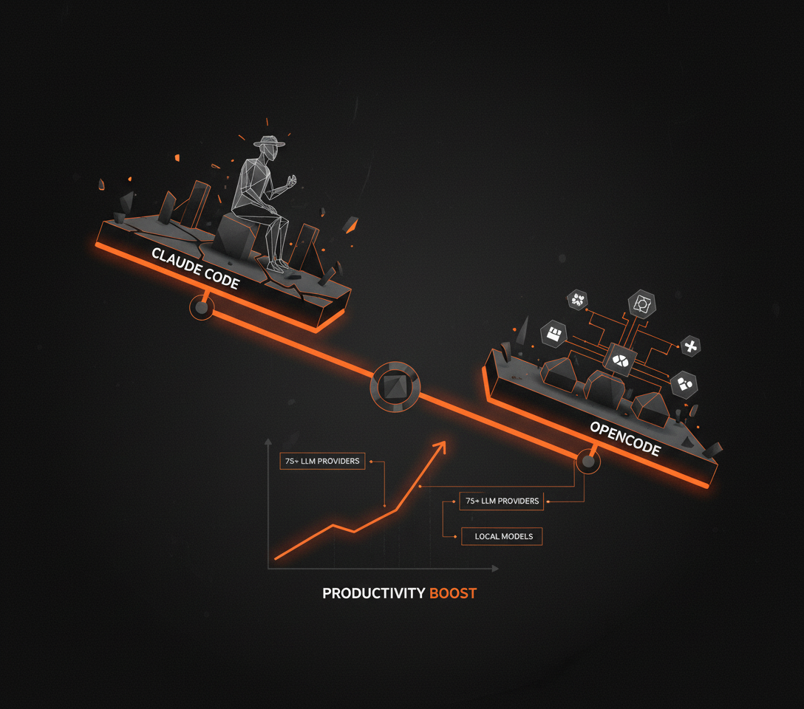

# Designing Real-World AI Agents Workshop

A hands-on workshop building a hybrid AI system with two MCP servers: a **Deep Research Agent** and a **LinkedIn Writing Workflow** — both connected to a harness like Claude Code or Cursor.

Built as a lightweight companion to the [Agentic AI Engineering Course](https://academy.towardsai.net/courses/agent-engineeringad). The course covers ~40 hours of material; this workshop distills the core patterns into ~2 hours of building.

## Example Output

Here's what the system produces end-to-end — from a topic idea to a finished LinkedIn post with AI-generated images:

<table>
  <tr>
    <td></td>
    <td></td>
    <td></td>
    <td></td>
  </tr>
</table>

<details>
<summary>Generated post (click to expand)</summary>

```
I switched my paid AI coding assistant. The productivity boost is real.

After months of frustration, leaving Claude Code wasn't easy, even with a Pro subscription.

But OpenCode changed everything.

I was skeptical at first. Another open-source tool claiming to be better?

It simply performs. It's a Go-based agent with a surprisingly polished terminal UI. It's fast.

The real difference? Agent orchestration.

OpenCode understands complex ideas better. It analyzes the codebase in more detail.
Its LSP integration makes a big difference for complex projects.

Claude Code often felt limited to its own models. OpenCode gives me options.
I can connect it to over 75 LLM providers, even local models.

This flexibility means I can pick the best model for any task. Or optimize for cost.

Even if you have a Claude Pro subscription, you're not getting the full flexibility
OpenCode offers. You might still face high API costs if you try to push Claude Code
too hard. OpenCode helps avoid that.

I'm already planning to explore its Go codebase. That's the power of open source.

What AI coding assistants are you actually using? What's your real experience been like?
```

</details>

> Browse more full examples (seed, research, post drafts, reviews, final post + image) in the [`examples/`](examples/) directory.

## What You'll Build

**Deep Research Agent** — An MCP server that runs deep research using Gemini with Google Search grounding and native YouTube video analysis:

```
user topic → [deep_research queries] × N → analyze_youtube_video → compile_research → research.md
```

**LinkedIn Writing Workflow** — An MCP server that generates LinkedIn posts with an evaluator-optimizer loop:

```
research.md + guideline → generate post → [review → edit] × N → post.md → generate image
```

Both servers expose tools, resources, and prompts via the [Model Context Protocol](https://modelcontextprotocol.io/), letting any MCP-compatible harness orchestrate the workflow.

## Tech Stack

| Component | Tool |
|-----------|------|
| LLM API | Google Gemini (via `google-genai` SDK) |
| MCP Framework | FastMCP |
| Data Validation | Pydantic |
| Settings | Pydantic Settings |
| Observability | Opik |
| Image Generation | Gemini Flash Image |
| QA | Ruff |
| Package Manager | uv |

## Quick Start

Already have Python 3.14+, uv, and Make installed? Get running in 60 seconds:

```bash
git clone https://github.com/decodingml/designing-real-world-ai-agents-workshop.git
cd designing-real-world-ai-agents-workshop
cp .env.example .env          # add your GOOGLE_API_KEY
uv sync
make test-end-to-end          # verify everything works
```

## Prerequisites

### 1. Python 3.14+

```bash
python --version   # should print 3.14.x
```

> **Note:** Python 3.14 is required (not 3.13 or earlier). If using pyenv: `pyenv install 3.14.0`. Download from [python.org](https://www.python.org/downloads/) if needed.

### 2. uv package manager

```bash
uv --version   # should print 0.7.x or later
```

Install: `curl -LsSf https://astral.sh/uv/install.sh | sh` — see [uv docs](https://docs.astral.sh/uv/getting-started/installation/) for other methods.

### 3. GNU Make

```bash
make --version   # pre-installed on macOS/Linux
```

Windows users: install via [chocolatey](https://chocolatey.org/) (`choco install make`) or copy the commands from the [Makefile](Makefile) directly.

### 4. Google AI Studio API Key

Get one at [aistudio.google.com/apikey](https://aistudio.google.com/apikey). This is **required** — all LLM calls use Gemini.

### 5. Opik Account (optional)

For observability and evaluation tracking. Create an account at [comet.com/site/products/opik](https://www.comet.com/site/products/opik/) and get your API key from the settings page.

## Installation

1. **Clone the repository:**

   ```bash
   git clone https://github.com/decodingml/designing-real-world-ai-agents-workshop.git
   cd designing-real-world-ai-agents-workshop
   ```

2. **Configure environment variables:**

   ```bash
   cp .env.example .env
   ```

   Edit `.env` and set at minimum:

   ```bash
   GOOGLE_API_KEY=your-key-here
   ```

   Optional (for observability and evals):

   ```bash
   OPIK_API_KEY=your-key-here
   OPIK_WORKSPACE=your-workspace-name
   ```

3. **Install dependencies:**

   ```bash
   uv sync
   ```

4. **Verify the setup:**

   ```bash
   make test-research-workflow
   ```

   This runs a research query using Gemini. If it completes without errors, you're good to go.

## Running the Code

There are three ways to run the workflows:

| Mode | Best for | Requires |
|------|----------|----------|
| **Scripts** | Verify setup works, quick smoke tests | Terminal only |
| **MCP Servers** | Interactive use with AI harness | Claude Code or Cursor |
| **Skills** | Guided slash-command workflows | Claude Code only |

### Scripts

Run workflows directly from the terminal via `make`. Useful for verifying your setup works and running quick smoke tests. See [`examples/`](examples/) for full end-to-end output samples.

**Test workflows:**

```bash
make test-research-workflow    # Research on a sample topic → test_logic/research.md
make test-writing-workflow     # Generate post from research → test_logic/post.md
make test-end-to-end           # Both steps sequentially
```

> **Note:** `test-writing-workflow` requires `test_logic/research.md` to exist. Run `test-research-workflow` first, or use `test-end-to-end`.

**Full dataset run:**

The [`datasets/`](datasets/) directory contains a pre-built LinkedIn posts dataset with seeds, guidelines, research documents, ground truth posts, and generated outputs — used for both batch runs and evaluation.

```bash
make run-dataset-writing           # Research + write for all dataset posts (with images)
make run-dataset-writing-no-image  # Same, skip image generation (faster)
```

**Evaluation (requires Opik):**

```bash
make upload-eval-dataset    # Upload evaluation splits to Opik
make eval-dev               # LLM judge on dev split
make eval-test              # LLM judge on test split
make eval-online            # Generate + judge posts on the fly
```

### MCP Servers

Connect the servers to an MCP-compatible harness (Claude Code, Cursor) for interactive use.

**Setup:** The `.mcp.json` file is pre-configured. Both servers start automatically when you open the project in Claude Code or Cursor.

| Server | Tools | Prompt |
|--------|-------|--------|
| `deep-research` | `deep_research`, `analyze_youtube_video`, `compile_research` | `research_workflow` |
| `linkedin-writer` | `generate_post`, `edit_post`, `generate_image` | `linkedin_post_workflow` |

**Usage:**

1. Open the project in Claude Code or Cursor
2. Invoke an MCP prompt (e.g., `research_workflow`) to get guided through the full workflow
3. Or call individual tools directly for fine-grained control

**Manual server start (advanced):**

```bash
make run-research-server    # stdio transport
make run-writing-server     # stdio transport
```

### Skills (Claude Code only)

Pre-built slash commands that orchestrate the MCP tools with sensible defaults. All output goes to `outputs/{topic-slug}/`.

| Command | What it does |
|---------|-------------|
| `/research` | Deep research on a topic → `research.md` |
| `/write-post` | Generate LinkedIn post from existing research → `post.md` + `post_image.png` |
| `/research-and-write` | Full pipeline: research a topic, then write a post from it |

Example:

```
/research-and-write
```

The skill will ask you for a topic and guideline, then run the full pipeline end-to-end. Check [`examples/`](examples/) to see what each step produces.

## QA

```bash
make format-fix             # Auto-format with ruff
make lint-fix               # Auto-fix lint issues
make format-check           # Check formatting
make lint-check             # Check linting
```

## Project Structure

```
├── src/
│   ├── research/              # Deep Research Agent MCP server
│   │   ├── server.py          # FastMCP entry point
│   │   ├── config/            # Settings, constants, prompt templates
│   │   ├── models/            # Pydantic schemas for structured LLM output
│   │   ├── app/               # Business logic handlers
│   │   ├── tools/             # MCP tool implementations
│   │   ├── routers/           # MCP tool, resource, and prompt registration
│   │   └── utils/             # Gemini client, file I/O, Opik, markdown helpers
│   └── writing/               # LinkedIn Writer MCP server
│       ├── server.py          # FastMCP entry point
│       ├── profiles/          # Shipped markdown profiles (structure, terminology, character, branding)
│       ├── config/            # Settings, constants, prompt templates
│       ├── models/            # Pydantic schemas (Post, Review, Profiles)
│       ├── app/               # Business logic handlers
│       ├── evals/             # LLM judge metric, dataset upload, evaluation harness
│       ├── tools/             # MCP tool implementations
│       ├── routers/           # MCP tool, resource, and prompt registration
│       └── utils/             # Gemini client, Imagen, Opik helpers
├── datasets/                  # LinkedIn posts dataset with labels and splits
├── examples/                  # Full end-to-end output samples (seed → research → posts → image)
├── inputs/                    # Seed and guideline files
├── scripts/                   # Entrypoints and test scripts
├── .mcp.json                  # MCP server configuration for harnesses
├── Makefile                   # Command center
└── .env.example               # Environment variable template
```

## Next Steps

| Resource | Description |
|----------|-------------|
| [Agentic AI Engineering Course](https://academy.towardsai.net/courses/agent-engineering) | Our full course. 34 lessons. Three end-to-end portfolio projects. A certificate. And a Discord community. |
| [Agentic AI Engineering Guide](https://email-course.towardsai.net/) | Free 6-day email course on the mistakes that silently break AI agents in production. |
| [AI Engineering Cheatsheets](https://github.com/louisfb01/ai-engineering-cheatsheets) | Quick-reference sheets for agents, RAG, fine-tuning, and more. Ready to be plugged into Claude Code as context. |

## License

MIT License. See [LICENSE](LICENSE) for details.

Copyright (c) 2026 Paul Iusztin, Towards AI Inc
