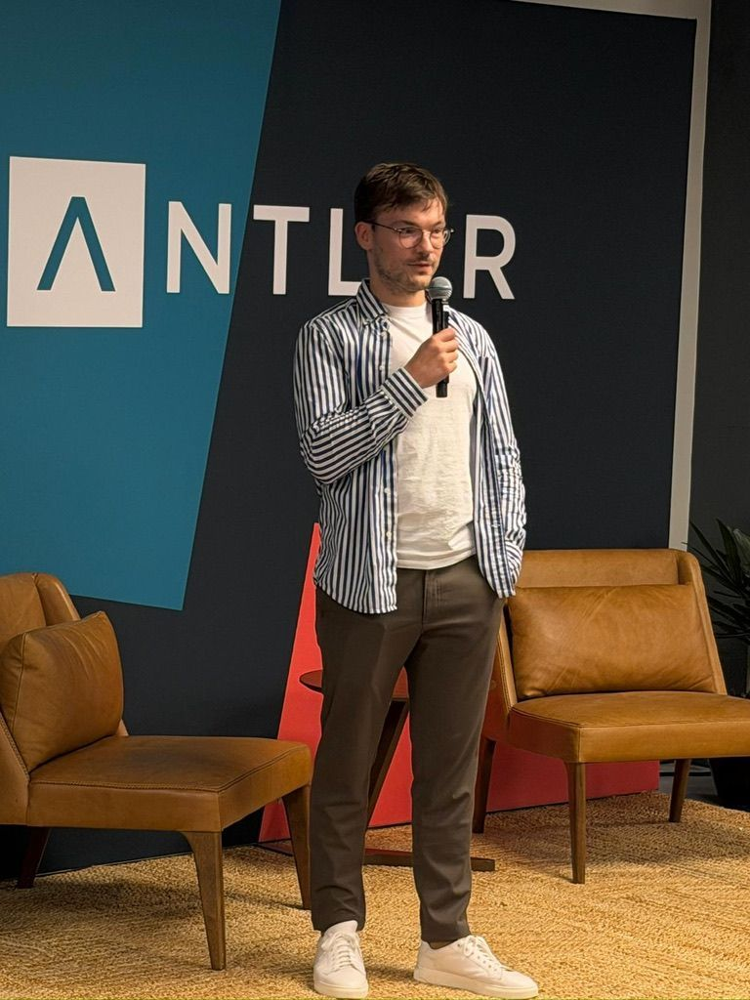

# 6 months ago, I never imagined I’d be hosting my own AI event in San Francisco.

**Published:** 2025-11-23T13:30:21.262Z
**Content Type:** Image
**Reactions:** 179 | **Comments:** 38 | **Shares:** 4
**LinkedIn:** https://www.linkedin.com/feed/update/urn:li:activity:7398352208578355200

## Media

## Content

6 months ago, I never imagined I’d be hosting my own AI event in San Francisco.

Yesterday, it happened...

Together with the ZTRON team (specifically, Stephen and Jona), we organized our first in-person session.

We booked a space, shared our story, and had people from Meta, Nvidia, Google, and early-stage startups show up to learn something from us.

That alone feels surreal.

But if I’m honest, it didn’t go perfectly...

We had 70 RSVPs, but only 10 people came. 
The timing was off. 
The location was tricky.

And for a moment, it was easy to feel disappointed.

Then I realized something: 
A year ago, I would’ve been terrified to stand in that room.

Back in London, my first talk had me rehearsing 10 times over.

I was anxious, over-prepared, and afraid to make mistakes.

Yesterday, I didn’t rehearse once.

I just spoke fluently, confidently, and naturally.

Most importantly, I enjoyed it.

I looked people in the eye. 
I paused. 
I connected. 
I wasn’t trapped in my own nerves 
I was present.

Was it perfect? No.

Could I have engaged more, asked more questions, played more with emotion?  
Absolutely.

But this time, the balance shifted... 
I wasn't as scared, and I wasn't overthinking.

If you told me two months ago that I’d host an AI event in San Francisco, and that people from top tech companies would learn something from it, I wouldn’t have believed you.

For me, that’s the real win.

I'm grateful to Stephen Ribbon for initiating the event, to Jona Rodrigues for leveling up the presentation, and to the people who showed up and shared their thoughts.

Here’s to more reps, more learning, and more moments where excitement outweighs nerves🥂
