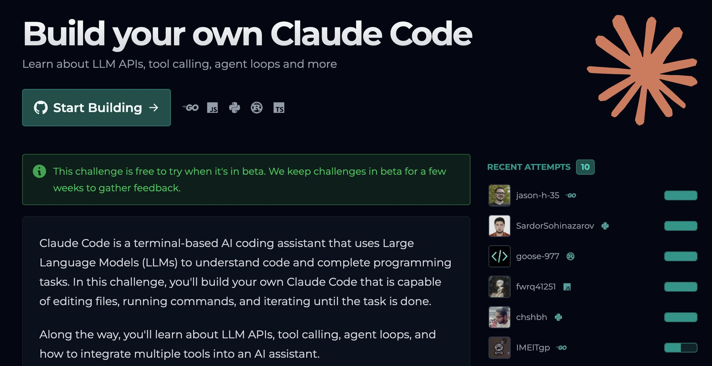

# If there’s one thing that’s helped me more than anything as an engineer...

**Published:** 2026-02-20T13:30:28.397Z
**Content Type:** Image
**Reactions:** 142 | **Comments:** 21 | **Shares:** 12
**LinkedIn:** https://www.linkedin.com/feed/update/urn:li:activity:7430604758542860289

## Media

## Content

If there’s one thing that’s helped me more than anything as an engineer...

It has to be this:

Learning with the intention to teach.

When you know you’ll have to explain something, you approach it differently.

You don’t just “use” the abstraction.
You break it apart.
You rebuild it.

And try to understand why it works.

Early in my career, I did this a lot...

I used to implement ML algorithms from scratch using research papers just to be sure I fully understood what was happening under the hood.

This is why I love the approach CodeCrafters.io (YC S22) take to teaching.

They break things apart and walk you through how to rebuild it from scratch.

And they recently released a new project: Build your own Claude Code.

So instead of just using Claude Code…
You build your own version of it.

A terminal-based AI coding assistant that can:
 
• Edit files
• Run shell commands
• Call tools
• Iterate in a loop until a task is complete

Along the way, you'll also learn:
 
• How LLM APIs work
• Tool calling and structured outputs
• Agent loops and planning
• How multiple tools integrate into a single assistant

By the end of the project, you'll have a deep understanding of the mechanics behind AI coding agents.

Here's the gist:

Learn as if you're preparing to teach.

And one of the best ways to do that as an engineer is to build from scratch.

CodeCrafters.io (YC S22) will help you with this.

And I highly recommend their new Claude Code from scratch challenge.

Get it here (affiliate): https://lnkd.in/dQQm3bPV

P.S. Most developers can fully reimburse the cost through their corporate L&D budget.
