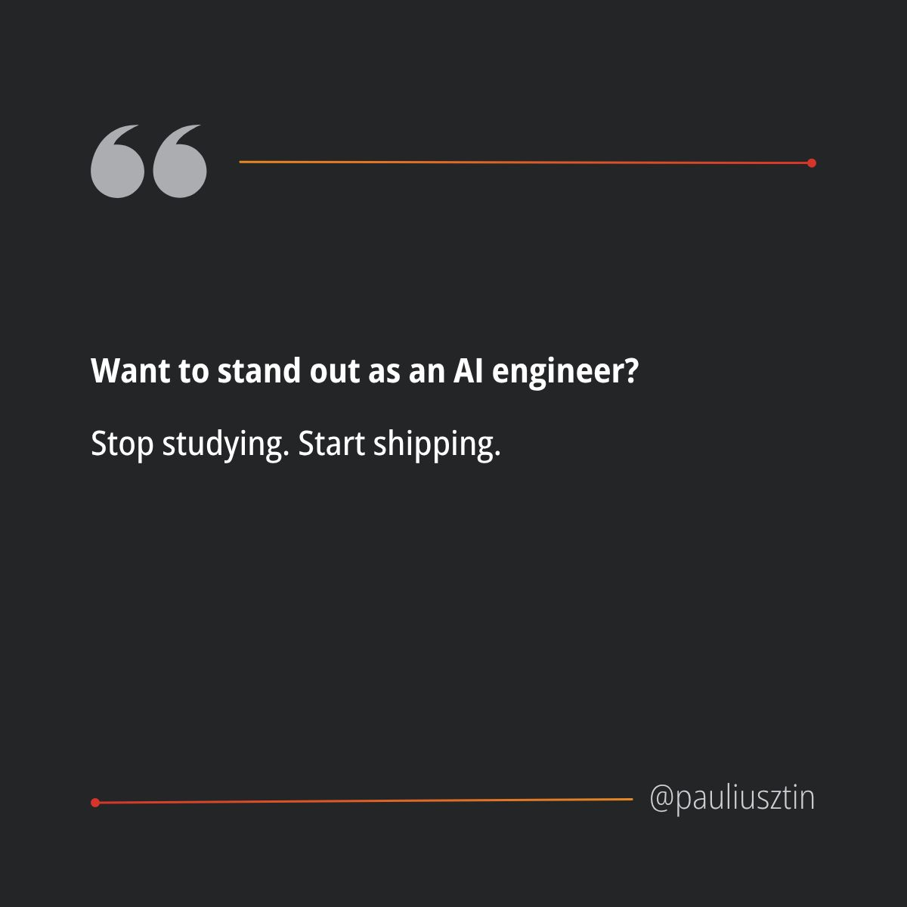

# I've been an engineer in the AI space for 8+ years.

**Published:** 2025-10-11T12:30:23.044Z
**Content Type:** Image
**Reactions:** 285 | **Comments:** 34 | **Shares:** 24
**LinkedIn:** https://www.linkedin.com/feed/update/urn:li:activity:7382754438337327104

## Media

## Content

I've been an engineer in the AI space for 8+ years.

If I could go back in time, here are 3 things I wouldn't waste my time on again:

𝟭/ 𝗧𝗼𝗼 𝗺𝘂𝗰𝗵 𝗺𝗮𝘁𝗵

Studying advanced algebra, geometry, or mathematical analysis won't help much.

All you need is fundamental knowledge of statistics (e.g., probabilities, histograms, and distributions) and algebra (e.g., vector and matrix multiplications).

This will solve 80% of your AI engineering problems 
(And you’ll sound smarter than the average software engineer).

𝟮/ 𝗙𝗼𝗰𝘂𝘀𝗶𝗻𝗴 𝘁𝗼𝗼 𝗺𝘂𝗰𝗵 𝗼𝗻 𝘁𝗼𝗼𝗹𝗶𝗻𝗴

Principles > tools.

Most of the time, you’ll work with vendor solutions like AWS, GCP, or Databricks.

Don’t waste your energy chasing the newest framework every week.

Stick with proven open-source tools like Docker, Grafana, Terraform, Metaflow, Airflow - and build systems.

𝟯/ 𝗗𝗲𝗲𝗽 𝗿𝗲𝘀𝗲𝗮𝗿𝗰𝗵 𝗼𝗻 𝗟𝗟𝗠 𝗮𝗿𝗰𝗵𝗶𝘁𝗲𝗰𝘁𝘂𝗿𝗲𝘀

You don’t need to dive into the bleeding-edge stuff.

Just go through the “Attention Is All You Need” paper inside out.

Leave the complicated stuff to the researchers and fine-tuning guys.

𝗛𝗲𝗿𝗲'𝘀 𝘁𝗵𝗲 𝗺𝗮𝗶𝗻 𝗴𝗶𝘀𝘁:

Understanding the vanilla transformer architecture is enough to grasp the latest inference optimization techniques (required to fine-tune or deploy LLMs at scale).

AI engineering is not ML research.

Learn what matters. 
Skip what doesn't.

P.S. Have you made any of these mistakes?
