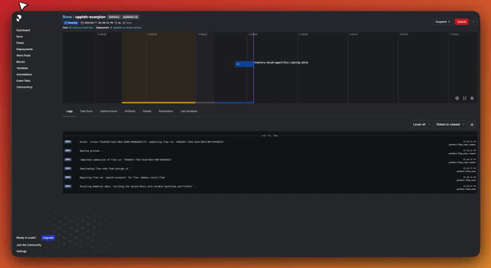

# I've spent the past 2 years productionizing AI agents.

**Published:** 2026-02-19T13:30:27.809Z
**Content Type:** LinkedInVideo
**Reactions:** 145 | **Comments:** 33 | **Shares:** 14
**LinkedIn:** https://www.linkedin.com/feed/update/urn:li:activity:7430242368211066881

## Media

## Content

I've spent the past 2 years productionizing AI agents.

Here's an unpopular opinion I've developed over time:

Durable workflow tools are more important than AI frameworks.

And it's not because frameworks are bad...
They just solve a different problem.

AI frameworks solve:
 
• Prompt templating and versioning
• Tool definition and orchestration logic
• Structured output parsing and validation

They make agents smart.

But they don’t solve what happens when things break.

In the video demo, the agent fails a tool call and retries up to 3 times before succeeding.

That’s durability.

We don’t fail the whole agent.
We only retry the failing step.

And that’s where tools like Prefect shine.

Let me paint the picture...

Imagine a 6-step agent pipeline:
 
1. LLM: analyze transcript → $0.003
2. Tool: store_event → free
3. Tool: store_fact → free
4. LLM: summarize findings → $0.004
5. Tool: search related data → ❌ fails (timeout)
6. LLM: synthesize answer → $0.003

Step 5 fails.

Without durable execution?

You restart from step 1.

You just burned $0.007 re-running LLM calls that already succeeded.

Now scale that:
 
• 100 agent runs/day
• 30% failure rate (normal in distributed systems)
• ~$0.01 wasted per failed retry

That’s:

~$9/day
~$270/month
~$3,240/year

In pure token waste.

And that’s before counting:
 
• Duplicated writes
• Double notifications
• Corrupted state
• Debugging time

With tools like Prefect?

Steps 1-4 are cached.
The flow resumes at step 5.

And there’s another subtle reason I emphasize Prefect.

Traditional orchestrators like Airflow or Dagster require precompiled DAGs.

Agents don’t work like that.
They decide their next action dynamically based on LLM output.

Prefect follows normal Python control flow:

𝚒𝚏/𝚎𝚕𝚜𝚎, 𝚠𝚑𝚒𝚕𝚎, 𝚝𝚛𝚢/𝚎𝚡𝚌𝚎𝚙𝚝.

Your agent stays plain Python.

The orchestrator adds retries, caching, and observability without forcing you into a static graph.

That matters at scale.

Here’s the mental model:

AI framework = reasoning layer
Prefect = durability layer
K8s = infrastructure layer

There’s one tool that sits somewhere in between: LangGraph.

It offers:
 
• Node-level retries
• Checkpointing
• Resume-from-step execution

That’s powerful.

But it still doesn’t connect durability to infrastructure:
 
• Queues
• Workers
• Horizontal scaling
• Deployment management
• Operational visibility

Since modern LLM APIs already make tool calling and structured outputs straightforward…

I will still pick a durable workflow tool over an AI framework any day.

You can swap reasoning layers.
You do not want to rebuild durability and infrastructure from scratch.

Start with durable orchestration.

Then choose an AI framework if you truly need one.

Not the other way around.

AI frameworks are optional.
Durability is not.

P.S. If you removed durability today, how much hidden retry waste would you discover?
